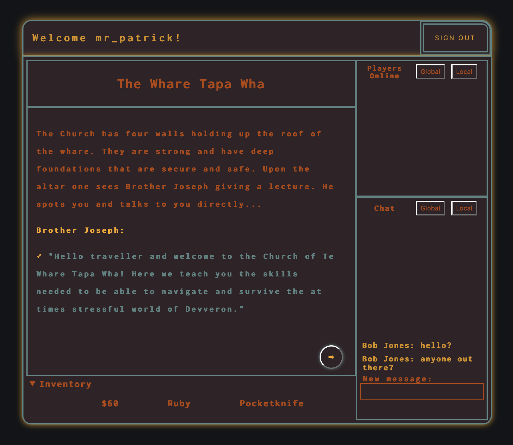

# Devveron 2.0

This is a text-based multiplayer game built in a week using React and Websocket, testing our technical skills and working collaboratively on a larger project. The socket.io library enabled us to keep track of global state on the client side. Using Websocket tech as a creative solution to keeping track of the current state of gameplay in place of something like Redux. This challenged us to think up creative ways of passing functions and data between components, which in turn reduced the frequency of database CRUD functions required.

This is currently a working prototype.

## Tech

- TypeScript
- React
- Websocket
- Express
- SQLite
- SCSS

## User Stories

As a user I want to be able to...
- ...sign up securely
- ...create a character
- ...navigate through the world
- ...complete at least one quest
- ...collect gold and spend it on new items
- ...chat with friends currently online
- ...have my progress saved when I log out

## Database structure

### Players

| Name | Type | Notes |
|---|---|---|
| user | string | pk, links to auth0 pub |
| char_name | string | |
| pronouns | string | |
| description | text | |
| inventory | text | `#` seperated strings, defaultTo(``) |
| location | string | defaultTo(`Town Square`) |
| progress | string | defaultTo(``) |
| gold | integer | defaultTo(0) |

## Redux Store

| Name | Type |
|---|---|
| Inventory | `string[]` |
| Messages | `{from: string, message: string}[]` |
| Nearby PCs | `{name:string, pronouns:string, description:string}[]` |

<!-- ## Other notes

[Conflict Resolution Plan](https://docs.google.com/document/d/1R4Gunji-XKpJoc_1CfpgQABldjdQSgHE07fA_936u4g/edit)

[Tech Plan](https://docs.google.com/document/d/1QO11svnE5w68hl98H-61lrhrzLKYH-wd1eBO4vnKW6g/edit?usp=sharing)

[World Content](https://docs.google.com/document/d/18wc8wBpq54KihdWJsRnKKFsaeraTVpoDvPUJu-0DF_0/edit?usp=sharing) -->
